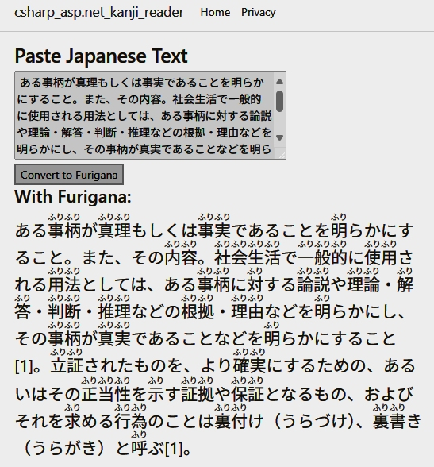

# Furigana Reader 🈶📖

[](https://dotnet.microsoft.com/en-us/download/dotnet/8.0)
[](LICENSE)


**Furigana Reader** is a web-based kanji reading assistant built with C# and ASP.NET Core Razor Pages. Paste any Japanese text and instantly view it with **furigana annotations** (readings above the kanji), rendered using semantic HTML `<ruby>` tags.

---

## 🖼 Preview

<div align="left">
  
</div>
<div align="left">
  
</div>


---

## ✨ Features

- 📝 Paste Japanese text to get furigana annotations
- 🧠 Detects kanji using Unicode range (U+4E00–U+9FAF)
- 📚 Uses `<ruby><rt></rt></ruby>` for native furigana rendering
- ⚙️ Built in C# with ASP.NET Core Razor Pages
- 🔐 Runs on `https://localhost` with dev cert

---

## 🔧 Tech Stack

| Layer     | Technology                    |
|-----------|-------------------------------|
| Frontend  | Razor Pages, HTML5, CSS       |
| Backend   | ASP.NET Core 8.0              |
| Language  | C#, Regex, JMdict (planned)   |
| Hosting   | Kestrel / IIS Express (local) |

---

## 🚀 Getting Started

### Prerequisites

- [.NET SDK 8.0](https://dotnet.microsoft.com/en-us/download/dotnet/8.0)
- Visual Studio 2022+ or VS Code

### Run Locally

```bash
git clone https://github.com/bernardlawes/csharp-aspnet-kanji-reader.git
cd furigana-reader
dotnet run


Then open:
🌐 https://localhost:5001

📅 Roadmap
 Furigana rendering via Regex + <ruby>

 JMdict-based reading lookup


📄 License
This project is licensed under the MIT License.
See the LICENSE file for details.

🙏 Acknowledgments
EDRDG for the JMdict and Kanjidic datasets

Unicode.org for kanji range references

The ASP.NET community


--------


# 📂 Data Directory

This folder contains local dictionary and cache data files used by the Kanji Reader web application.

---

## 📘 JMdict Dictionary File

This project uses the official **JMdict_e.xml** file provided by the [Electronic Dictionary Research and Development Group (EDRDG)](https://www.edrdg.org/).

### ❗️Important:
The JMdict file is **not included in this repository** due to its large size and licensing considerations.

---

## 🔽 How to Obtain JMdict_e.xml

1. Visit the official JMdict download page:  
   🔗 https://www.edrdg.org/jmdict/edict_doc.html

2. Look for a section titled **“Download”**, then download the file:  
   **`JMdict_e.gz`**

3. Extract it to get the uncompressed XML file:  
   **`JMdict_e.xml`**

4. Place the extracted file in this directory:  

	csharp-asp.net-kanji-reader/Data/JMdict_e.xml


---

## 📦 Optional: JSON Cache

This folder may also contain a `JMdictCache.json` file generated by the app to reduce startup time.

If it's not present, the app will build it on first load (from `JMdict_e.xml`).

---

## 🛡 License Reminder

JMdict is © by the **EDRDG** and provided under their license. See details at:  
🔗 https://www.edrdg.org/edrdg/licence.html

Please do not redistribute the file without their permission.


--------


Built with ❤️ by Bernard Lawes for fellow Japanese learners
